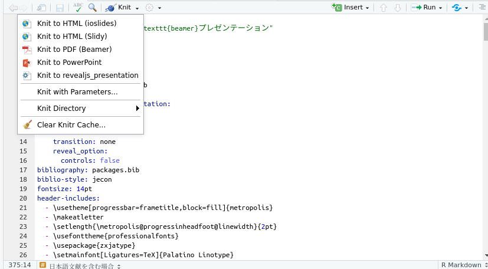
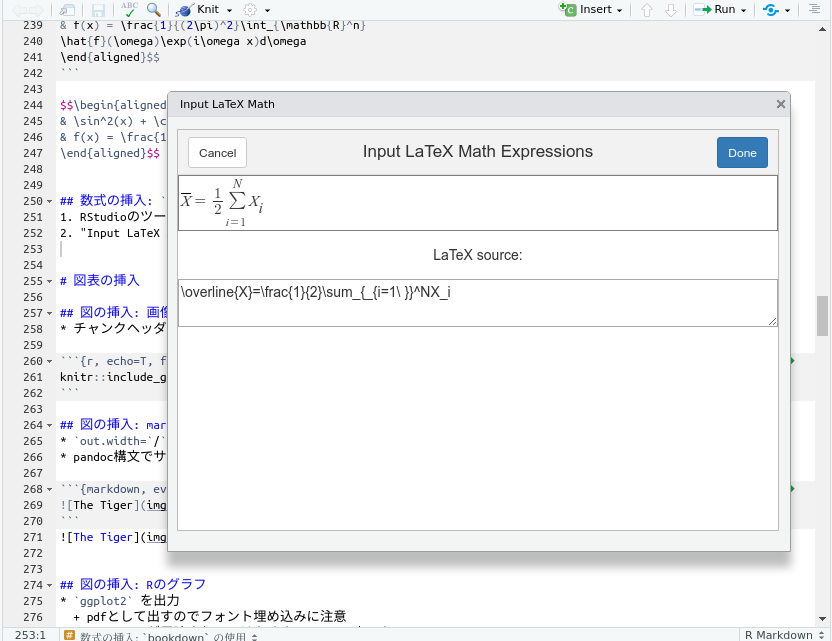
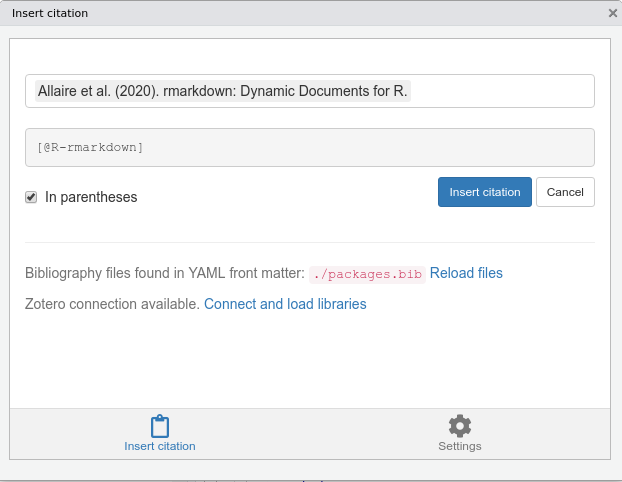

```{r setup-document, include=F}
options(tinytex.latexmk.emulation = F)
base_size <- 12
knitr::opts_chunk$set(
  include = T, echo = F, message = F, warning = F, digits = 3, cache = T, comment = NA, # 標準出力の ## を消す
  # チャンク内コード40字で折り返す (不完全?マルチバイト文字に対応してない?)
  tidy.opts=list(width.cutoff=40), 
  tidy=T,
  # 画像関係: 中央寄せ, 幅50%, 水平並べ
  fig.align = "center", out.width = "50%",  fig.show='hold',
  # ggplot2の日本語埋め込みに必要
  # pointsize は組み込みグラフィックデバイスにのみ反映される
  dev = "cairo_pdf", dev.args = list(family = "Noto Sans CJK JP", pointsize = base_size)
  )
```

## このスライドは何?
* あまり情報が流れていない, rmarkdownとbeamerで日本語を含むスライドを作るためのテンプレート兼ヒント集
* `reveal.js`などhtml媒体は他の資料を参照
  + [ここ](https://kazutan.github.io/SappoRoR6/rmd_slide.html#/)や[ここ](https://kazutan.github.io/fukuokaR11/intro_rmarkdown_d.html)を見よ
* もともとは自分用に作ったテンプレだったものを万人向けに修正

## 想定される用途

* Tokyo.R などRを使った話を発表する際の資料作成
* 技術・アカデミック寄りの話題を想定
* 具体的に要求されるもの
  + **日本語表示**
  + ラスタまたはベクタ画像の挿入
  + 表の挿入
  + Rコードを見やすく表示
  + 参考文献の相互参照/リスト自動生成
  + **LyX やoverleafより簡単であること**
  + **なんかナウでオサレな感じは求めてない**
    + 自由すぎるデザインは不可

## 先行研究の紹介
* 伊東『[R MarkdownとBeamerでプレゼンテーション資料作成](https://www.slideshare.net/hirokito/r-markdownbeamer-88777082)』
  + \LuaLaTeX を使って日本語でBeamerスライド作成する方法
* 伊東先生の資料との違い:
  + エンジンを\XeLaTeX に変更
  + 日本語文献bibファイル・bstファイルに対応
  +  スライド作例を多少充実させた
  + その他体裁にこだわりたい人向け
    - 「表X」「図X」といったキャプション

## `reveal.js` じゃダメなの?
* 個人的にデザインとかあまり好きじゃない
* 上下左右に動いて空間識失調になる
  + (個人の体験です)
  + 上下のみにもできる
* htmlよりも不変な媒体にしたい
  + pdfが明確に優れているかは怪しい
* ~~Q: お前が使いこなせてないだけじゃないの?~~
  + ~~A: うるさい~~


## パワーポイントじゃダメなの?
* 私は**持ってない**
* シンタックスハイライトが面倒
  + パワポの場合は[VSCode](https://notchained.hatenablog.com/entry/2017/02/20/221446)か[`reprex`](https://reprex.tidyverse.org/articles/articles/rtf.html)でコピペ
* ドラッグ&ドロップで位置調整は便利
* しかしポンチ絵芸術になりがち
* 極力シンプルにして視線誘導の負担をなくすべき
  + 徹底するかは好みの問題

## 技術的に厄介だったところ
* htmlとpdf(\LaTeX)とで微妙に違う挙動
  + ネット上の情報はhtml前提が多い
  + pandocチョットワカル必要
* 日本語を含む参考文献リスト
  + \upBibTeX の適用
  + 細かいオプション, 特に`metropolis`特有の仕様
* RStudio Cloud で動くかは未確認
  + 日本語表示がおかしい説あり
  
# 使い方

## セットアップ
1. TeXLive (2018 以降)のインストール
  + 分からなければ[TeX wiki のページ](https://texwiki.texjp.org/?TeX%20Live)を参考に
2. [metropolisテーマ](https://github.com/matze/mtheme)のインストール
  + 一部の設定を消せば他のテーマも使用可能

## 基本
1. RStudioのツールバーの"knit"
2. またはドロップダウンして"Knit to PDF (Beamer)"

```{r knit-image, out.width="90%"}

```

## フォント指定
* 使うマシンに応じて以下の箇所を適当に変える
* `set*font`は欧文用
* `setja*font`は和文用
* 初期設定はRictyを除き全て[Google Fonts](https://fonts.google.com/?category=Sans+Serif#standard-styles)で入手可
* インラインでのフォント変更は**想定してない**
  + 不可能ではないが面倒

```{yaml header-example1, eval=F, echo=T}
- \setmainfont{Roboto Slab}
- \setsansfont{Roboto}
- \setmonofont{Ricty Diminished}
- \setjamainfont{Noto Serif CJK JP}
- \setjasansfont{Noto Sans CJK JP}
- \setjamonofont{Ricty Diminished}
```


## 基本構文
- markdown的な書き方でできる
- "`## `タイトル" でスライドの開始
  + \LaTeX コマンドも挿入可能

```{md enum, eval=F, echo=T}
# 節見出し
## タイトル1
- **太字** **bold**
- _強調_ _emph_
- `タイプライタ体` `mono`
```

- **太字** **bold**
- _強調_ _emph_
- `タイプライタ体` `mono`

## BeamerやRMarkdown使用に役立つ資料
* 伊東『[R MarkdownとBeamerでプレゼンテーション資料作成](https://www.slideshare.net/hirokito/r-markdownbeamer-88777082)』(\LuaLaTeX 使用)
* 松田『[Beamer読本-講演用スライド作成のために-](http://ayapin-film.sakura.ne.jp/LaTeX/slides.html#beamer)』
* Kazutan『[R Markdownによるスライド生成](https://kazutan.github.io/SappoRoR6/rmd_slide.html#/)』『[R Markdown入門](https://kazutan.github.io/kazutanR/Rmd_intro.html)』
* Atusy『[R Markdown + XeLaTeX で日本語含め好きなフォントを使って PDF を出力する](https://blog.atusy.net/2019/05/14/rmd2pdf-any-font/)』
* R Markdown 2.0 チートシートの[日本語訳](https://rstudio.com/wp-content/uploads/2016/11/Rmarkdown-cheatsheet-2.0_ja.pdf), Takahashi, M.訳

## もう少しくわしいやつ

* Atusy 『[R MarkdownユーザーのためのPandoc’s Markdown](https://atusy.booth.pm/items/1453002)』
* 謝益輝 (yihui) "[knitr - Elegant, flexible, and fast dynamic report generation with R](https://yihui.org/knitr/)" (開発者本人)
* Xie, Yihui & C. Dervieux "[R Markdown Coobook](https://bookdown.org/yihui/rmarkdown-cookbook/)"

```{r yihui-logo, out.height="10%", fig.cap="謝益輝近影"}
knitr::include_graphics("img/yihui.png")
```

## 今回使うパッケージ
* このファイル作成には以下を使用している
  + 図表作成とか最低限必要なものだけ

```{R load-packages, echo=T, class.source = "numberLines LineAnchors"}
require(conflicted)
require(tidyverse)
require(ggthemes)
require(ggdag)
require(patchwork)
```

* 以下はインストールのみ/読み込む必要なし
  - `citr`: 引用文献の挿入をGUIで
  - `bookdown`: 数式をGUIで

## ソースコードの表示: 基本事項
* `echo=T`でチャンク内コードを表示
  + デフォでは非表示
  + **自動でシンタックスハイライト**
* はみ出す場合は`tidy=F`して手動改行
  + 日本語等で折り返し地点がうまく行かない
* `class.source = "numberLines, LineAnchors"` で行番号表示([参考](https://blog.atusy.net/2019/04/18/rmd-line-num/))

## ソースコードの表示: 出力例

```{r}
text <- '```{r, echo=T, class.source = "numberLines, LineAnchors"}
require(conflicted)
require(tidyverse)
require(ggthemes)
require(ggdag)
```'
cat(text)
```

```{R load-packages2, echo=T, class.source = "numberLines LineAnchors", eval=F}
require(conflicted)
require(tidyverse)
require(ggthemes)
require(ggdag)
```


# 数式関係

## 数式の挿入: 行内(インライン)

* markdown風のLaTeXコード埋め込み
* \LaTeX の数式を`$`で挟む
* 例: `らんま$\frac{1}{2}$`
  + 出力: らんま$\frac{1}{2}$
  + 注: 行内で分数はスラッシュ使ったほうが見やすい
* セリフフォント使用
  + スライドはサンセリフが良いとされる
  + しかし数式の統一感がない
  + (個人の好み?) 

## 数式の挿入: 独立行

* `$$`で挟んだ範囲に\LaTeX 構文

```{latex, eval=F, echo=T}
$$\begin{aligned}
& \sin^2(x) + \cos^2(x) = 1\\
& f(x) = \frac{1}{(2\pi)^2}\int_{\mathbb{R}^n}
\hat{f}(\omega)\exp(i\omega x)d\omega
\end{aligned}$$
```

$$\begin{aligned}
& \sin^2(x) + \cos^2(x) = 1\\
& f(x) = \frac{1}{(2\pi)^2}\int_{\mathbb{R}^n}\hat{f}(\omega)\exp(i\omega x)d\omega
\end{aligned}$$


## 数式の挿入: `bookdown` の使用
1. RStudioのツールバー "Addins"
2. "Input LaTeX Math"

```{r math-input, out.height="40%", fig.cap="bookdownの数式入力機能"}

```
* 一部対応してない記号もある?
  + `\mathbb{}`とか`\hat{}`とか
* 数式のみで`\aligned`等環境の入力は不可

# 図表の挿入

## 図の挿入: 画像ファイル貼り付け
* チャンクヘッダの`out.width=`/`out.height=`でサイズ調整

```{r, echo=T, fig.cap="いつもの虎(TeXLiveより)", out.width="20%"}
knitr::include_graphics(c("img/tiger.eps", "img/tiger.pdf", "img/tiger.png"))
```

## 図の挿入: markdown構文で貼り付け
* `out.width=`/`out.height=`が適用されない
* pandoc構文でサイズ指定

```{markdown, eval=F, echo=T}
{ height=30% }
```
{ height=30% }


## 図の挿入: Rのグラフ
* `ggplot2` を出力
  + pdfとして出すのでフォント埋め込みに注意
  + `theme()`が反映されるのはあくまでRStudio上のもの
  + pdfでは相対的フォントサイズが変わる問題
  + `fig.cap=`でキャプションを設定可能. `labs(title = )`と違い自動相互参照あり

```{r plot-example, fig.cap="ggplot2の出力例: irisデータ"}
theme_set(
  theme_classic(base_size = 12 * .pt) +
  theme(legend.position = "top",
        axis.title.y = element_text(angle = 90, vjust = .5), legend.title = element_blank()))
data(iris)
ggplot(iris, aes(x = Sepal.Length, y = Sepal.Width, color = Species)) +
  geom_point() + labs(x = "萼長", y = "萼幅")
```

## 図の挿入: 文字の大きさをそろえるには
* よくあるトラブル
  + RStudio と出力された画像ファイルが違う!
  + 本文と図に描いた文字の大きさが違う!
* beamer側でpt単位で指定した前提
* `cairo_pdf(pointsize)` はビルトインデバイスのサイズ
* `base_size` は pt単位

参考: https://uribo.hatenablog.com/entry/2018/06/11/232041

```{r plot-size, out.height="50%"}
thm <-theme_bw(base_size = 12)
d <- tibble(x = 1, y = 1, label = "🍣")
g1 <- ggplot(d, aes(x = x, y = y, label = label)) + geom_point() + geom_text() + thm + labs(title = "サイズ指定なし")
g2 <- ggplot(d, aes(x = x, y = y, label = label)) + geom_point() + geom_text(size = 1) + thm + labs(title = "size = 1")
g3 <- ggplot(d, aes(x = x, y = y, label = label)) + geom_point() + geom_text(size = 11) + thm + labs(title = "size = 11")
(g1 / g2 / g3) + patchwork::plot_annotation(title = "base_size = 11")
```

## 図の挿入: 再現可能なポンチ絵
* 概念図とかの図示はどうするか
  + NOT データの視覚化(ビジュアライゼーション)
  + `ggplot2`の本来の使い方ではない
* `ggdag` はネットワーク図に使える
  + 因果ダイアグラム, 遷移図, グラフィカルモデル等
* `ggforce` は[ベン図の描画に応用可能](https://rpubs.com/sdutky/559050)
  + 世間的にはグラフの部分拡大用パッケージ?
* 詳しくは個別のマニュアル参照
* 霞が関流ポンチ絵は**専門外**

## 図の挿入: ポンチ絵の例1
* [以前作ったやつ](https://speakerdeck.com/ktgrstsh/r-and-epidemical-mathematical-models)の転載

```{r punch-chart-example, out.width="90%", out.height="70%", fig.cap="ggdagで作ったYJ-SEIRモデルの遷移図"}
diag_yjseir <- dagify(
  Y ~ E,
  J ~ E,
  S ~ Y,
  E ~ S,
  I ~ E + Y,
  R ~ J + I,
  labels = c("Y" = "Suspected", "J" = "間接接触", "S" = "感受性", "E" = "潜伏", "I" = "感染", "R" = "回復"),
  coords = list(x = c(Y = 1.5, J = 2, S = 0, E = 1, I = 2, R =3),
                y = c(Y = .5, J = -.5, S = 0, E = 0, I = 0, R = 0)
                )
  ) %>% tidy_dagitty() %>% mutate(label_edge = c("beta", NA, NA, "gamma", NA, "lambda",  NA, NA, NA))
diag_yjseir %>% ggplot(aes(x = x, y = y, xend = xend, yend = yend)) +
  geom_dag_node(size = 30) +
  geom_dag_edges(edge_width = 2, arrow_directed = grid::arrow(length = grid::unit(.05, "npc"), type = "closed")) +
  geom_dag_text(aes(label = label)) +
  geom_label(aes(x = (x + xend)/2, y = (y + yend)/2, label = label_edge), parse = T, size = 10) +
  theme_dag_blank() + coord_cartesian(ylim=c(-1, 1))
```

## 図の挿入: ポンチ絵の例2

* `ggforce::geom_circle()` を利用
  + 参考: [How to Plot Venn Diagrams Using R, ggplot2 and ggforce](https://scriptsandstatistics.wordpress.com/2018/04/26/how-to-plot-venn-diagrams-using-r-ggplot2-and-ggforce/)

```{r venn, fig.cap="ベン図の例"}
require(ggforce)
df.venn <- data.frame(
  x = c(-.5, 0, .5), y = c(0, .8, 0), r = c(1, 1, 1), labels = c('コーディング', 'デザイン', 'タイポグラフィ'))
ggplot(df.venn, aes(x0 = x, y0 = y, r = r, fill = labels)) +
  geom_circle(alpha = .3, size = 1, colour = 'grey') +
  geom_label(aes(x = x, y = y, label = labels)) +
  annotate("text", x = 0, y = .2, label = "LaTeX", size = 5 * ggplot2::.pt) +
  coord_fixed() + scale_fill_pander() +
  theme_void() + theme(legend.position = "none")
```

## 表の挿入: データフレーム

- Rのデータフレームとして作成して出す
  + はみ出す場合は縮小
  + 最低限の情報だけ掲載するのは大前提
  + `df_print: kable` では`caption`指定が[ややこしい](https://stackoverflow.com/questions/48410861/how-to-add-table-caption-using-df-print)

```{r kable-iris, eval=F, echo=T, tidy=F}
data(iris)
knitr::kable(head(iris[, 1:3]),
             caption="kable()による表示")
```

## 表の挿入: データフレームを`kable()`で表示

```{r kable-iris-display, echo=T, tidy=F}
data(iris)
knitr::kable(head(iris[, 1:3]),
             caption="kable()による表示")
```

## 表の挿入: LaTeXコード
- latex のコード
  + そのまま貼り付けることができる
  + `\input{tab.tex}` でコピペなしで貼り付け可
  + `stargazer`とかが生成したやつを貼れる
  + 凝ったことをしたいならこっち?
  
```{r tex-tab, echo=T, tidy=F}
xtable::xtable(head(iris)) %>%
  print(file = "tab.tex")
```
\input{tab.tex}

## 表の挿入: markdown
\small
```{markdown, eval=F, echo=T}
Table: 得点一覧

  クラス 科目   平均
  ------ ----- -----
  A      算数   $90$
  B      算数   $95$
  ------ ----- -----
```
\normalsize
Table: 得点一覧

  クラス 科目   平均
  ------ ----- -----
  A      算数   $90$
  B      算数   $95$
  ------ ----- -----

# 外部資料の引用方法

## ハイパーリンクの挿入
* urlは自動でリンク
  + https://rstudio.com/
* markdown方式のリンク
  + `[RStudio](https://rstudio.com/)`
  + [RStudio](https://rstudio.com/)
* 画像にハイパーリンク [{ height=10% }](https://rstudio.com/)

## 文献引用の方法

* `[@ref]` で番号引用: `\citep{ref}` に対応 (`[1]`)
* `@ref` で著者名引用: `\citet{ref}`に対応 (`hogehoge et al.`)
* `[@ref1; @ref1]` で連番引用 `[1, 2]`
* 以下引用テスト

```{markdown eval=F, echo=T, tidy=F}
[@R-base; @R-bookdown; @R-citr;
 @varian2014Intermediate; @wickham2016Data]
```

[@R-base; @R-bookdown; @R-citr;
@varian2014Intermediate; @wickham2016Data]

## 文献引用の補助: 引用子の補完

* 重複・書き間違えの防止
* `citr`パッケージを使うと楽
  + ツールバーの `Addins` から選択
  + zotero連携機能あり

```{r citr-image, fig.cap="citrパッケージのGUI"}

```

## 文献引用の補助: 文献管理
* Mendeley, Zotero, ReabCubeの3つが多い?
* 私はZoteroを使っている
  + 多言語対応, 連携機能の充実, 料金などの理由
  + 参考: 『[Mendeley Exodus Mendeley から Zotero への移行の手引き~](https://ill-identified.hatenablog.com/entry/2019/03/05/195257)』
* `RefManageR` パッケージ
  + Rでbibファイルをパースしたりする
  + 文献管理用には既存ソフトで十分?

# その他の機能

## 絵文字

* [`BXcoloremoji`](https://github.com/zr-tex8r/BXcoloremoji)をインストールすれば可能
  + `\coloremoji{}` で絵文字表示: \ifdefined\coloremoji \coloremoji{🍣} \else (ここに絵文字) \fi
  + RStudioエディタでは**表示が変な場合も**
* グラフ描画には特に設定必要なし
  + ソースコード上のものは文字化けする
```{r sushi-plot, echo=T}
plot(1:10, pch = "🍣")
```


# トラブルシューティング

## エラーの原因がよくわからない
* **キャッシュ削除すると良くなることもある**
  + (**叩けば直る**レベルの雑アドバイス)
  + 前回エラーで失敗したときのキャッシュが悪さしてることは結構ある
  + または `cache = F` でキャッシュを残さないようにする
  + エラーメッセージが実態と矛盾してるときはまず試す

# まとめ

## 結果どうなったか
* **良く**なったこと
  + `lstlisting.sty`**より見やすい**シンタックスハイライト
  + Rの画像や数値出力を**コピペしなくて済む**
  + 一画面に収めるための構成だけ考えれば済むように
* **悪く**なったこと
  + (パワポユーザ的に)WYSIWYGでないので作りづらい?
  + 数式のリアルタイムレンダリング/補完はLyXが依然優秀
  + python作業中(jupyter notebookへの)**不満高まり**
  + ポンチ絵も`ggplot2`で作らねばという**強迫症状**

## 改良・機能追加したいところ

* 手動セットアップ作業の削減
  * 例: [ヘッダのテンプレート化](https://atusy.github.io/tokyor85-original-rmd-format)
* 細かいレイアウト修正
* 他の言語のシンタックスハイライト
* 最低限のテーマ変更オプションの追加
* グラフ描画の作業負担を減らす工夫
* [issues](https://github.com/Gedevan-Aleksizde/my_latex_templates/labels/enhancement) に詳細


# 細かい技術的な話

## yamlヘッダ設定: 出力の設定

* \XeLaTeX 生成
  + \LuaLaTeX 使用者が多数派?
* "`keep_tex: true`" エラー発生時の原因特定に

```{yaml output-example, eval=F, echo=T}
output:
  beamer_presentation:
    latex_engine: xelatex
    citation_package: natbib
    keep_tex: true
```

## \LaTeX プリアンブル: テーマ設定

* metropolisテーマを使用
  + https://github.com/matze/mtheme
  + 他のモダンなテーマは*日本語と相性悪い*
  + "`beamer_presentation:`" 内で指定すると**オプション指定できない**

```{yaml preemble-theme, eval=F, echo=T}
header-includes:
  - \usetheme[progressbar=frametitle,block=fill]{metropolis}
  - \makeatletter
  - \setlength{\metropolis@progressinheadfoot@linewidth}{2pt}
  - \usefonttheme{professionalfonts}
```

## \LaTeX プリアンブル: 日本語フォント設定
* `zxjatype` で日本語フォント読み込み
  + `mainfont: <HOGEHOGE>` も可
  + しかし欧文和文で別にしたい
* 和文欧文サイズ比調整などは[開発者のサイト](http://zrbabbler.sp.land.to/zxjatype.html)等参照

```{yaml header-example2, eval=F, echo=T}
- \usefonttheme{professionalfonts}
- \usepackage{zxjatype}
- \setmainfont[Ligatures=TeX]{EB Garamond}
- \setsansfont[Ligatures=TeX]{Roboto}
- \setmonofont{Ricty Diminished}
- \setjamainfont{Noto Serif CJK JP}
- \setjasansfont{Noto Sans CJK JP}
- \setjamonofont{Ricty Diminished}
```


## \LaTeX プリアンブル: その他の設定
* ハイパーリンクの色を見やすく変更
* "Figure 1", "Table 1" を 「図1」「表1」に
* 参考文献リストのフォントサイズ縮小
* コードチャンクに行番号
  + 表示は選択式
* その他いろいろな微調整をtexのプリアンブルで設定

## 日本語文献にどう対応しているか
* [`jecon.bst`](https://github.com/ShiroTakeda/jecon-bst/blob/master/jecon.bst)を使いたい
  + マルチバイト文字未対応 の\BibTeX 
  + 日本語は \upBibTeX 必要
  + `biblatex` ではフォーマットに不満
* `knitr`は日本語書誌情報処理未対応
  + 内部では自前の設定で`latexmk`を呼び出し
  + 呼び出しているラッパにオプションなし
  + 積極的に改修の気配なし([参考](https://github.com/yihui/tinytex/issues/70))
* 自前の設定を使用する([参考](https://github.com/kenjimyzk/bookdown_ja_template))
  + `tinytex.latexmk.emulation = F`
  + [ここ](https://texwiki.texjp.org/?Latexmk)を参考に`.latexmkrc`設定
  + **Rmdと同じディレクトリに**上記を置く

----
`r if (knitr::is_latex_output()) '
\\section*{参考文献}
'`

```{r references, include=F}
knitr::write_bib(c(
  .packages(), 'knitr', 'rmarkdown', 'htmlwidgets', 'webshot', 'DT',
  'miniUI', 'tufte', 'servr', 'citr', 'rticles'
), 'packages.bib')
```